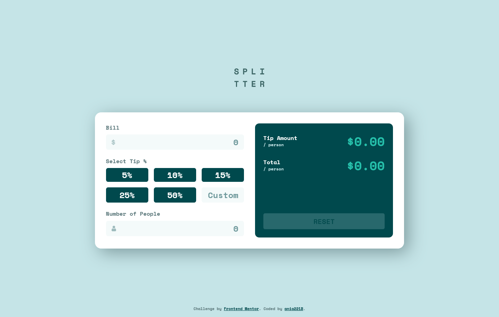

# Frontend Mentor - Tip calculator app solution

This is a solution to the [Tip calculator app challenge on Frontend Mentor](https://www.frontendmentor.io/challenges/tip-calculator-app-ugJNGbJUX). Frontend Mentor challenges help you improve your coding skills by building realistic projects.

## Table of contents

- [Overview](#overview)
  - [The challenge](#the-challenge)
  - [Screenshot](#screenshot)
  - [Links](#links)
- [My process](#my-process)
  - [Built with](#built-with)
  - [What I learned](#what-i-learned)
  - [Continued development](#continued-development)
  - [Useful resources](#useful-resources)
- [Author](#author)

## Overview

### The challenge

Users should be able to:

- View the optimal layout for the app depending on their device's screen size
- See hover states for all interactive elements on the page
- Calculate the correct tip and total cost of the bill per person

### Screenshot




### Links

- Solution URL: [GitHub](https://github.com/ania221B/tip-calculator)
- Live Site URL: [GitHub Pages](https://ania221b.github.io/tip-calculator/)

## My process

### Built with

- Semantic HTML5 markup
- CSS custom properties
- Flexbox
- CSS Grid
- Mobile-first workflow

### What I learned

#### Forms and landmarks

##### Landmarks

- A `landmark` is an important subsection of the page.
- A `landmark` role is an abstract role for a section of content that is important enough for users to want to be able to navigate to it quickly and easily.
- Landmarks help assistive technologies in easy navigation and content finding.
- To create a landmark role you should use semantic elements.
- You mustn't use `role=landmark`.

[ARIA: landmark role](https://developer.mozilla.org/en-US/docs/Web/Accessibility/ARIA/Roles/landmark_role) article on MDN explaining what a landmark and landmark role are and also listing best practices related to these two

##### The form element

- The `<form>` element defines a `form` landmark when it has an accessible name.
- An **accessible name** is a short string that is associated with an element and serves as a label for it. It describes its purpose and distinguishes it from other elements.
- One way to create an accessible name is to make use of attributes such as `aria-label`, `aria-labelledby` or `title`.
  For the tip calculator I used `aria-labelledby` attribute. I've put a `header` element with `h1` heading inside the `form` and wrapped the rest of content in a div:

```html
<form action="#" autocomplete="off" class="tip-calculator container" aria-labelledby="form-title">
	<header class="center">
		<h1 class="sr-only">Splitter, the tip calculator</h1>
		<div class="logo" aria-hidden="true"></div>
	</header>
	<div class="tip-calculator__wrapper"></div>
</form
```

[ARIA: form role](https://developer.mozilla.org/en-US/docs/Web/Accessibility/ARIA/Roles/form_role) - an MDN article about the form role
[Providing Accessible Names and Descriptions](https://www.w3.org/WAI/ARIA/apg/practices/names-and-descriptions/) - explanation of accessible names and descriptions and instructions on how to use them

#### The SVG

The design of the calculator includes an SVG with a wordmark for the calculator. Since the image is the name itself I decided to hide it for screen readers with `aria-hidden` attribute. This way the name "Splitter" is provided to screen reader users in the heading,which is visually hidden, and in the SVG for sighted users.

#### Grouping of the controls

Grouping related controls makes the form easier to understand for the users, as they can focus on smaller chunks of it. Groups of controls can be created in two ways:

- with the use of `<fieldset>` and `<legend>` elements
- through associating related controls with WAI-ARIA

I chose the first option.

- `<fieldset>` is the container that holds related controls together
- `<legend>` functions as a heading for the whole group

[Grouping Controls](https://www.w3.org/WAI/tutorials/forms/grouping/) - explanation on how to group related form controls

#### Resetting `<fieldset>` and `<legend>` default styling

`<fieldset>` and `<legend>` elements have some styling by default. The way they normally look doesn't match the design. Therefore these default styles had to be removed:

```css
legend {
  padding: 0;
  display: table;
}

fieldset {
  border: 0;
  padding: 0.01rem 0 0 0;
  margin: 0;
  min-width: 0;
}

body:not(:-moz-handler-blocked) fieldset {
  display: table-cell;
}
```

[Reset your fieldset](https://thatemil.com/blog/2015/01/03/reset-your-fieldset/) - article explaining how to remove default styling of `<fieldset>` and `<legend>` elements

#### Input fields: `type="number"` vs. `inputmode="decimal"`

The `number` type inputs are to be used for numbers that are supposed to be incremented. Hence browsers usually display arrows for increasing and decreasing the value.
This is not the case for the tip calculator and so I decided to use `<input>` with the type of `text` and `inputmode` attribute:

```html
<input type="text" inputmode="numeric" pattern="\d*" />
```

#### Rounding numbers with JS

- `Math.round()` function rounds the number to the nearest integer and returns that value.
- `toFixed()` function converts the number to a string and keeps the specified number of decimal places. The number of decimal places you want is the parameter of the function. This parameter is optional and if omitted it is assumed it's `0`.
- `parseFloat()` converts a string to a floating point number

When rounding numbers in JavaScript it is a good idea to use exponential notation, which lets you avoid any rounding errors:

```javascript
const numberToRound = 4.2765;
const rounded = parseFloat(Math.round(numberToRound + "e2") - "e-2");
```

[Rounding Decimals in JavaScript](https://www.jacklmoore.com/notes/rounding-in-javascript/) - short article explaining how to round decimal numbers in JavaScript
[How to Round to a Certain Number of Decimal Places in JavaScript](https://medium.com/swlh/how-to-round-to-a-certain-number-of-decimal-places-in-javascript-ed74c471c1b8) - more detailed article on rounding based on the one provided above

#### Accessible error messages

##### 1. Indicate that input is invalid

- First you need to indicate that the input is invalid. You can do so with the `aria-invalid` attribute, which you add to the field with incorrect value. Once the input is corrected, the attribute needs to be removed
- Fields with `aria-invalid` attribute are read out as being invalid
- You can use `aria-invalid` to style the incorrect field appropriately:

```css
input[aria-invalid="true"] {
  color: red;
}
```

##### 2. Use visual indicators to draw attention to incorrect input

- This is self explanatory. You can use text color, borders, backgrounds, icons, etc.
- As noted above you can make use of `aria-invalid` attribute when styling

##### 3. Make sure the error will be read out to user

Use attributes on on the `div` containing the error message and present in HTML on page load:

- `role="alert"`
- `aria-live="assertive"` combined with `aria-relevant="additions removlas"`, you may also want to use `aria-atomic="true"` (if you want the element to be treated as a whole)
  Both `role="alert"` and `aria-live` change the element into a live region which means changes to it will be read out.
  `aria-alert` does the same thing as `aria-live="assertive"` + `aria-atomic="true"`

[How to make inline error messages accessible](https://hidde.blog/how-to-make-inline-error-messages-accessible/) - article explaining techniques you can use to ensure error messages are accessible
[ARIA live regions](https://developer.mozilla.org/en-US/docs/Web/Accessibility/ARIA/ARIA_Live_Regions) - an MDN article with detailed information about live regions and different attributes you can use

### Continued development

- Forms
- Accessibility
- JavaScript

### Useful resources

- [ARIA: landmark role](https://developer.mozilla.org/en-US/docs/Web/Accessibility/ARIA/Roles/landmark_role) article on MDN explaining what a landmark and landmark role are and also listing best practices related to these two
- [ARIA: form role](https://developer.mozilla.org/en-US/docs/Web/Accessibility/ARIA/Roles/form_role) - an MDN article about the form role
- [Providing Accessible Names and Descriptions](https://www.w3.org/WAI/ARIA/apg/practices/names-and-descriptions/) - explanation of accessible names and descriptions and instructions on how to use them
- [Grouping Controls](https://www.w3.org/WAI/tutorials/forms/grouping/) - explanation on how to group related form controls
- [Reset your fieldset](https://thatemil.com/blog/2015/01/03/reset-your-fieldset/) - article explaining how to remove default styling of `<fieldset>` and `<legend>` elements
- [Rounding Decimals in JavaScript](https://www.jacklmoore.com/notes/rounding-in-javascript/) - short article explaining how to round decimal numbers in JavaScript
- [How to Round to a Certain Number of Decimal Places in JavaScript](https://medium.com/swlh/how-to-round-to-a-certain-number-of-decimal-places-in-javascript-ed74c471c1b8) - more detailed article on rounding based on the one provided above
- [How to make inline error messages accessible](https://hidde.blog/how-to-make-inline-error-messages-accessible/) - article explaining techniques you can use to ensure error messages are accessible
- [ARIA live regions](https://developer.mozilla.org/en-US/docs/Web/Accessibility/ARIA/ARIA_Live_Regions) - an MDN article with detailed information about live regions and different attributes you can use

## Author

- Frontend Mentor - [@ania221B](https://www.frontendmentor.io/profile/ania221b)
